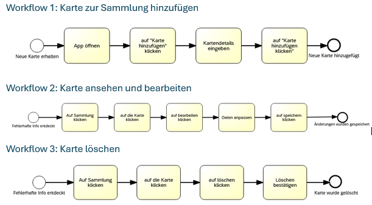
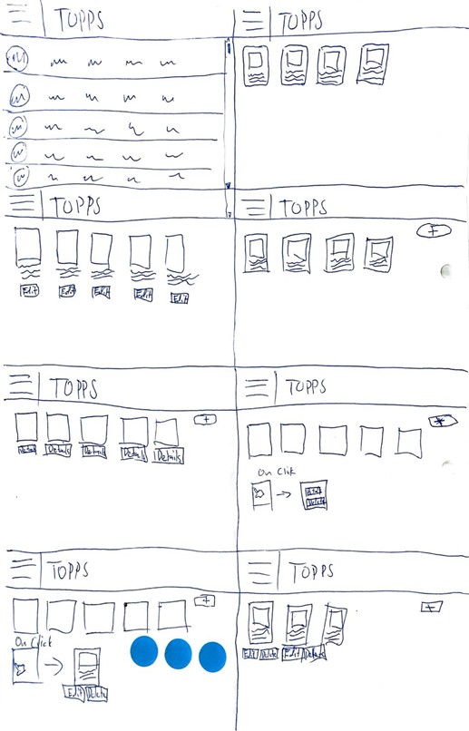
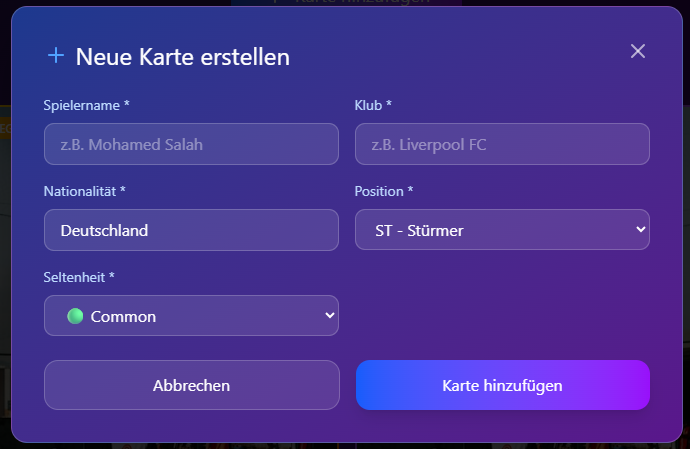
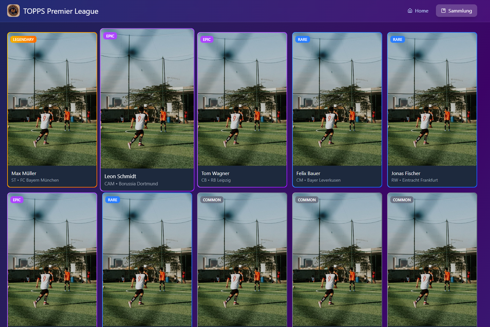
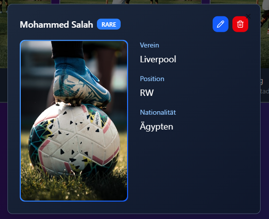
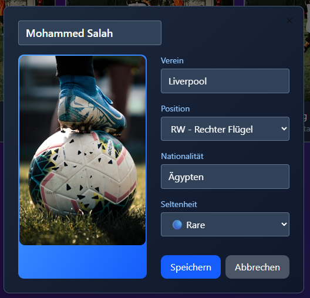
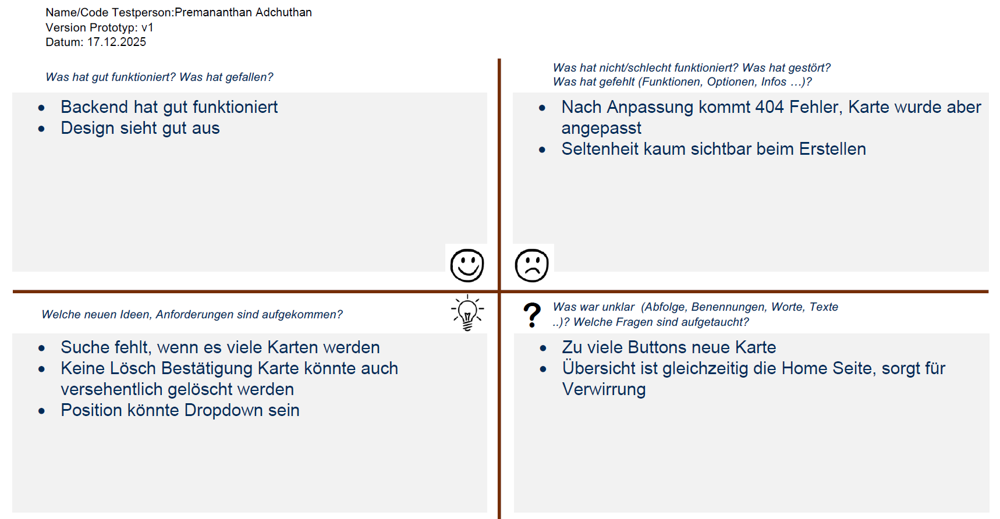
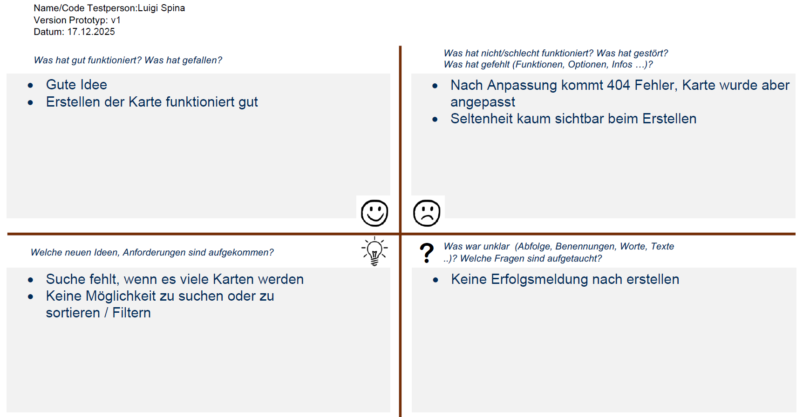
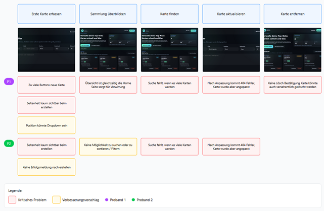

# Projektdokumentation – TOPPS Premier League Sammel-App

## Inhaltsverzeichnis

1. [Einordnung & Zielsetzung](#1-einordnung--zielsetzung)
2. [Zielgruppe & Stakeholder](#2-zielgruppe--stakeholder)
3. [Anforderungen & Umfang](#3-anforderungen--umfang)
4. [Vorgehen & Artefakte](#4-vorgehen--artefakte)
    - [Understand & Define](#41-understand--define)
    - [Sketch](#42-sketch)
    - [Decide](#43-decide)
    - [Prototype](#44-prototype)
    - [Validate](#45-validate)
5. [Erweiterungen [Optional]](#5-erweiterungen-optional)
6. [Projektorganisation [Optional]](#6-projektorganisation-optional)
7. [KI‑Deklaration](#7-ki‑deklaration)
8. [Anhang [Optional]](#8-anhang-optional)

> **Hinweis:** Massgeblich sind die im **Unterricht** und auf **Moodle** kommunizierten Anforderungen.

## 1. Einordnung & Zielsetzung
Kurz beschreiben, welches Problem adressiert wird und welches Ergebnis angestrebt ist.
- **Kontext & Problem:** Viele Sammler von Topps Premier League Karten haben ihre physischen Karten Über Ordner und Boxen verteilt und verlieren dadurch schnell den Überblick. Doppelungen, seltene Karten sowie wichtige Infos zu Spielern, Teams und Seltenheit sind nicht zentral erfasst. Dadurch fehlt eine klare Struktur bei der Verwaltung der Sammlung.
- **Ziele:**
    - Überblick und Ordnung in der physischen Kartensammlung schaffen
    - Schnelle und einfache Erfassung neuer Karten ermöglichen
    - Seltenheit (Rarity) und Besonderheiten klar sichtbar darstellen
    - Zentrale digitale Dokumentation aller Karteninformationen
    - Motivation und Stolz auf die eigene Sammlung fördern
    - Zeitaufwand für Verwaltung möglichst gering halten
- **Abgrenzung [Optional]:** Der Handel von Karten in der Applikation

## 2. Zielgruppe & Stakeholder
Wem nützt die Lösung, wer ist beteiligt oder betroffen?
- **Primäre Zielgruppe:** Sammler:innen von physischen Topps Premier League Karten, die ihre Sammlung einfach und übersichtlich digital inventarisieren möchten.  
- **Weitere Stakeholder [Optional]:** _[z. B. Verwaltung, Geschäftsleitung]_  
- **Annahmen [Optional]:** _[welche Hypothesen werden geprüft?]_

## 3. Anforderungen & Umfang
Beschreibt den verbindlichen Umfang gemäss Übungen und allfällige Erweiterungen.
- **Kernfunktionalität (Mindestumfang):**
    - **Karte zur Sammlung hinzufügen:** Neue Karte über einen klar sichtbaren Button erfassen und speichern.
    - **Karte ansehen & bearbeiten:** Detailansicht einer Karte öffnen und Informationen anpassen.
    - **Karte löschen:** Einzelne Karten gezielt aus der Sammlung entfernen.
    - **Sammlung anschauen:** Sammlung öffnen, durch Karten scrollen und Überblick erhalten.

- **Akzeptanzkriterien:**
    - Nutzende können eine neue Karte von Start bis Speicherung ohne Fehlermeldung erfassen.
    - Nutzende können bestehende Karten aufrufen und bearbeiten, wobei die Änderungen korrekt gespeichert werden.
    - Nutzende können Karten löschen, die danach nicht mehr in der Übersicht erscheinen.
    - Die Übersichtsseite lädt korrekt und zeigt alle gespeicherten Karten an.
    - Alle Workflows sind ohne zusätzliche Erklärungen verständlich und bedienbar.
- **Erweiterungen [Optional]:**
    - **Suche & Sortierung:** Sammlung clientseitig durchsuchen und nach verschiedenen Kriterien sortieren.
    - **Statistiken:** Gesamtübersicht mit Kartenanzahl, Rarity-Verteilung und Duplikaten.
    - **Login & Benutzerverwaltung:** Eigene Sammlung pro Nutzer durch Login.
    - **Duplikate anzeigen:** Doppelte Karten automatisch erkennen und filtern.

    **Akzeptanzkriterien:**
    - Nutzende können die Sammlung nach verschiedenen Kriterien durchsuchen und sortieren.
    - Die Statistik-Übersicht zeigt korrekte Gesamtzahlen, Rarity-Verteilungen und Duplikate an.
    - Nutzende können sich registrieren und einloggen und sehen ausschliesslich ihre eigene Sammlung.
    - Duplikate werden korrekt erkannt und können gezielt angezeigt werden.
# 4. Vorgehen & Artefakte
Die Durchführung erfolgt phasenbasiert; dokumentieren Sie die wichtigsten Ergebnisse je Phase.

### 4.1 Understand & Define
- **Ausgangslage & Ziele:** Viele Sammler:innen verwalten ihre physischen Topps Premier League Karten unstrukturiert und verlieren schnell den Überblick. Ziel ist eine einfache App zur digitalen Inventarisierung, die Ordnung schafft und ohne überflüssige Funktionen auskommt.
- **Zielgruppenverständnis:**

**Problemraumanalyse**

| Nutzer:innen | Bedürfnisse | Kontext / Herausforderungen | HMW |
| --- | --- | --- | --- |
| Kinder & Jugendliche Sammler:innen | - Überblick über eigene Karten - Erkennen von seltenen Karten (Rarity) - Stolz auf Sammlung | - Karten liegen lose oder in Ordnern - Doppelungen schwer erkennbar - Keine strukturierte Dokumentation | Wie könnten wir Sammler:innen dabei unterstützen, ihre physische Topps-Premier-League-Kartensammlung übersichtlich und jederzeit nachvollziehbar digital abzubilden? |
| Erwachsene Sammler:innen | - Strukturierte Inventarisierung - Schnelles Wiederfinden bestimmter Karten - Dokumentation von Besonderheiten | - Grosse Sammlungen - Zeitmangel - Unübersichtliche physische Ablage | Wie könnten wir die Besonderheiten einzelner Karten (z. B. Seltenheit, persönliche Notizen oder Funddetails) klar sichtbar machen? |

**Recherche**

Aktuell werden physische Topps Premier League Karten meist analog in Ordnern oder Boxen verwaltet, ergänzt durch umständliche digitale Hilfsmittel wie Excel-Listen, Notizen oder Fotos. Bestehende Apps fokussieren entweder auf rein digitale Karten oder auf Handel und Preise, sodass die eigentliche Sammlungsverwaltung nur eine Nebenrolle spielt. Es fehlt daher eine einfache, spezialisierte App zur übersichtlichen Inventarisierung physischer Karten mit Fokus auf Organisation, Seltenheit und persönliche Notizen – ohne Handelsfunktionen.
- **Wesentliche Erkenntnisse:**
    - Physische Sammlungen sind oft unübersichtlich und schlecht dokumentiert
    - Doppelungen und seltene Karten sind schwer erkennbar
    - Excel-Listen und Notizen sind umständlich und zeitaufwendig
    - Bestehende Apps decken den Bedarf für physische Karten nicht ab
    - Bedarf nach einer einfachen, fokussierten Inventarisierungs-App ohne Handelsfunktionen

### 4.2 Sketch
- **Variantenüberblick:** Die Skizze zeigt mehrere Crazy-8s-Varianten für die Übersichtsseite einer Topps-Kartensammlungs-App. Alle Varianten basieren auf demselben Grundaufbau (Header mit Logo, Kartenübersicht)
- **Skizzen:** Die Varianten unterscheiden sich darin, ob Karten als Liste oder Grid dargestellt werden, wie viele Informationen direkt sichtbar sind und ob Details über Klick oder separate Buttons erreichbar sind. Zudem variiert die Interaktion (Details, Bearbeiten, Löschen) sowie die Platzierung und Sichtbarkeit des "Karte hinzufügen"-Buttons.

### 4.3 Decide
- **Gewählte Variante & Begründung:**
    Gewählt wurde die Variante mit einer klaren Grid-Übersicht, bei der die Karten im Vordergrund stehen und Details erst bei Bedarf per Klick angezeigt werden.

**Entscheidkriterien:**

    - Hohe Übersichtlichkeit durch reduzierte Darstellung
    - Keine Überladung der Hauptansicht mit Details
    - Details auf Abruf (Ansehen, Bearbeiten, Löschen)
    - Einfacher und intuitiver Workflow für alle Nutzer:innen
    - Gut sichtbarer "Karte hinzufügen"-Button als zentraler Einstieg
    - Positives Feedback mit Fokus auf klare Struktur und leichte Bedienbarkeit

- **End-to-End-Ablauf:** Nutzende öffnen die App, sehen auf der Übersichtsseite ihre gesamte Kartensammlung und können über einen gut sichtbaren Button neue Karten hinzufügen. Bestehende Karten lassen sich per Klick ansehen, bearbeiten oder löschen. Alle Änderungen werden gespeichert und sind direkt in der Übersicht sichtbar.
- **Referenz-Mockup:** URL: https://direct-magic-18149687.figma.site/

Übersicht mit Sammelfortschritt, hervorgehobenen "besten Karten" und einem zentral platzierten Button zum Hinzufügen neuer Karten.

Formular zum Hinzufügen einer neuen Sammelkarte mit Pflichtfeldern für Spielername, Klub, Nationalität, Position und Seltenheit

Grid-Ansicht aller Karten der Sammlung mit Bild, Name, Verein und farblicher Kennzeichnung der Seltenheit

Detailansicht einer einzelnen Karte mit grossem Bild sowie Informationen zu Verein, Position und Nationalität, inklusive Aktionen zum Bearbeiten oder Löschen.

Bearbeitungsformular zur Anpassung der Karteninformationen (Name, Verein, Position, Nationalität, Seltenheit) mit Speichern- und Abbrechen-Option.

### 4.4 Prototype
- **Kernfunktionalität:** Übersichtliche Darstellung der gesamten Kartensammlung, Hinzufügen neuer Karten über ein Formular sowie Anzeigen, Bearbeiten und Löschen einzelner Karten über klar strukturierte Detail- und Bearbeitungsansichten.
- **Deployment:** https://direct-magic-18149687.figma.site/

#### 4.4.1. Entwurf (Design)
Beschreibt die Gestaltung und Interaktion.
> **Hinweis:** Hier wird der **Prototyp** beschrieben, nicht das **Mockup**.
- **Informationsarchitektur:** Die App ist flach und übersichtlich aufgebaut. Zentrale Einstiegsebene ist die Übersichtsseite (Sammlung), auf der alle Karten angezeigt werden. Über eine einfache Top-Navigation sind Startseite (Dashboard) und Sammlung erreichbar. Von der Sammlungsübersicht führen Klicks auf einzelne Karten zu einer Detailansicht, von dort weiter zu Bearbeiten oder Löschen. Das Hinzufügen neuer Karten erfolgt jederzeit über einen klar sichtbaren "+"-Button.
- **Oberflächenentwürfe:** 

Übersicht mit Sammelfortschritt, hervorgehobenen "besten Karten" und einem zentral platzierten Button zum Hinzufügen neuer Karten.

Formular zum Hinzufügen einer neuen Sammelkarte mit Pflichtfeldern für Spielername, Klub, Nationalität, Position und Seltenheit

Grid-Ansicht aller Karten der Sammlung mit Bild, Name, Verein und farblicher Kennzeichnung der Seltenheit

Detailansicht einer einzelnen Karte mit grossem Bild sowie Informationen zu Verein, Position und Nationalität, inklusive Aktionen zum Bearbeiten oder Löschen.

Bearbeitungsformular zur Anpassung der Karteninformationen (Name, Verein, Position, Nationalität, Seltenheit) mit Speichern- und Abbrechen-Option.

- **Designentscheidungen:**
    - **Reduzierte Navigation:** Klare Top-Navigation mit wenigen Einstiegspunkten, um Orientierung und Einfachheit zu gewährleisten.
    - **Karten im Fokus:** Grid-Darstellung, bei der die Karten visuell im Vordergrund stehen, da sie das zentrale Objekt der App sind.
    - **Details auf Abruf:** In der Übersicht werden nur die wichtigsten Informationen angezeigt; weitere Details erscheinen erst nach Klick, um Überladung zu vermeiden.
    - **Klare Handlungsaufforderungen:** Ein gut sichtbarer "Karte hinzufügen"-Button unterstützt den wichtigsten Workflow.
    - **Farbkodierung der Seltenheit:** Unterschiedliche Farben für Common, Rare, Epic und Legendary ermöglichen schnelles Erkennen auf einen Blick.

#### 4.4.2. Umsetzung (Technik)
Fasst die technische Realisierung zusammen.
- **Technologie‑Stack:** SvelteKit (Svelte 5) mit Vite, MongoDB‑Persistenz via mongodb, Deployment via Netlify‑Adapter
- **Tooling:** VS Code, Node.js + npm, Vite Dev Server, GitHub, MongoDB Atlas, Netlify  
- **Struktur & Komponenten:** 
    - **Routen:** /, /sammlung, /cards/new, /cards/[id]
     - **State/Stores:** lokal in Svelte 5 ($state), keine Stores. 
    - **Wichtige Komponenten:** CardForm.svelte, CardList.svelte
- **Daten & Schnittstellen [Optional]:** _[Datenquellen, API‑Entwürfe, Modelle]_
- **Besondere Entscheidungen:** Fokus auf Kernworkflow (Karten erfassen/bearbeiten/löschen); Detailansicht als Modal statt eigener Route; Bilder als Platzhalter statt Upload

### 4.5 Validate
- **URL der getesteten Version**: https://toppskick.netlify.app
- **Ziele der Prüfung:**
    - Finden Nutzer "Neue Karte" schnell und verstehen sie den Unterschied zwischen Übersicht und Detailseite?
    - Ist das Formular selbsterklärend (Pflichtfelder, Rarity-Auswahl)?
    - Wirkt Löschen sicher genug?
    - Reicht die Übersicht für die Sammlung zu managen?
    - Welche zusätzlichen Felder/Filter wollen Nutzer wirklich (Suche, Sortierung, etc.)?- 

- **Vorgehen:**
    - Setup: Laptop auf Schreibtisch; Testdaten: 3 vorbereitete Beispielkarten.
    - Methode: 1:1 Moderation + laut denken
    - Aufgabenstellung: Wird auf dem Bildschirm präsentiert
- **Stichprobe:** Getestet wurde der Prototyp mit 2 Studierenden, die Interesse an digitalen Anwendungen haben. Beide nahmen an moderierten 1:1-Usability-Tests teil. 
- **Aufgaben/Szenarien:**

    **Erste Karte erfassen**
    - Sie haben vor Kurzem begonnen, Ihre physischen Topps Premier League Karten digital zu verwalten. Eine neue Karte ist zu Ihrer Sammlung hinzugekommen und soll nun in der App festgehalten werden.
    - Bitte nutzen Sie die App so, wie Sie es im Alltag erwarten würden, um diese Karte zu erfassen.
    - Wenn Sie fertig sind, prüfen Sie, ob die Karte in Ihrer Sammlung erscheint und Sie sicher sind, dass sie korrekt gespeichert wurde.

    **Sammlung überblicken**
    - Sie öffnen die App, um sich einen schnellen überblick über Ihre Kartensammlung zu verschaffen. Sie möchten wissen, wie viele Karten Sie besitzen und welche Karten besonders selten oder wertvoll sind.
    - Bitte sehen Sie sich die übersicht an und erklären Sie, welche Informationen für Sie auf den ersten Blick verständlich sind und wo Sie noch Informationen vermissen.

    **Karte wiederfinden**
    - Sie möchten eine bestimmte Karte aus Ihrer Sammlung erneut aufrufen, zum Beispiel eine Karte, die Sie vor Kurzem hinzugefügt haben.
    - Bitte nutzen Sie die App so, wie Sie es erwarten würden, um diese Karte zu finden.

    **Karte aktualisieren**
    - Eine Karte in Ihrer Sammlung enthält veraltete oder falsche Informationen und soll angepasst werden.
    - Bitte ändern Sie die Angaben dieser Karte so, dass Sie später klar erkennen können, dass die änderung gespeichert wurde. Prüfen Sie anschliessend, ob die aktualisierten Informationen in der App richtig angezeigt werden.

    **Karte entfernen**
    - Eine Karte in Ihrer Sammlung wird nicht mehr benötigt, zum Beispiel weil sie doppelt oder falsch erfasst ist.
    - Bitte nutzen Sie die App so, wie Sie es erwarten würden, um diese Karte zu entfernen. Prüfen Sie anschliessend, ob die Karte tatsächlich aus der Sammlung gelöscht wurde und ob sich der Vorgang für Sie sicher und nachvollziehbar angefühlt hat.

- **Kennzahlen & Beobachtungen:**
    - **Erfolgsquote:** Alle Testpersonen (2/2) konnten den Hauptworkflow Karte anlegen → wiederfinden → bearbeiten → löschen grundsätzlich erfolgreich durchführen.
    - **Zeitbedarf:** Die Aufgaben wurden ohne längere Unterbrechungen erledigt; kleinere Verzögerungen entstanden durch Unsicherheiten bei Navigation und Button-Anordnung.
    - **Feedback Grids**
        

        

    - **Issue Map**

        
- **Zusammenfassung der Resultate:** Die Tests zeigen, dass der grundlegende Workflow (Karte anlegen, finden, bearbeiten und löschen) von allen Testpersonen erfolgreich verstanden und durchgeführt werden konnte. Besonders positiv wurde die einfache Grundidee und die funktionierende Erstellung von Karten bewertet. Gleichzeitig wurde deutlich, dass fehlendes Systemfeedback, zu viele Buttons und eine unklare Trennung zwischen Home- und Übersichtsseite zu Unsicherheiten führen. Zudem wünschen sich Nutzende bei grösseren Sammlungen Such-, Sortier- und Filterfunktionen.
- **Abgeleitete Verbesserungen:**
    1. **Oberfläche beim Erstellen anpassen:** Reduktion der Buttons und stärkere Hervorhebung der Seltenheit verbessern Übersicht und Verständlichkeit.
    2. **Navigation klarer trennen (Home vs. Übersicht):** Eine eindeutige Seitenstruktur reduziert Verwirrung über den aktuellen Kontext.
    3. **Löschbestätigung einführen:** Eine Bestätigungsabfrage verhindert versehentliches Löschen und steigert die wahrgenommene Sicherheit.
    4. **Klares Systemfeedback nach Aktionen:** Erfolgsmeldungen nach Erstellen und Bearbeiten sowie verständliche Fehlermeldungen erhöhen Sicherheit und Vertrauen.
    5. **Such-, Sortier- und Filterfunktionen ergänzen:** Erleichtert das Wiederfinden von Karten, besonders bei grösseren Sammlungen.
- **Umgesetzte Anpassungen [Optional]:** _[Im Prototyp umgesetzte Verbesserungen aufgrund der Erkenntnisse in der Evaluation]_ Idealerweise: Zwischenstände separat deployen, Änderungen dokumentieren.

## 5. Erweiterungen [Optional]
Dokumentiert Erweiterungen über den Mindestumfang hinaus.
- **Beschreibung & Nutzen:**
    - **Such- und Sortierfunktion in der Sammlung**

        Die Sammlung wurde um eine Such- und Sortierfunktion erweitert. Nutzer:innen können Karten schnell wiederfinden und ihre Sammlung nach verschiedenen Kriterien strukturieren. Dies erhöht die Übersichtlichkeit insbesondere bei grösseren Sammlungen.
    - **Gesamtfortschritt & Statistiken**

        Zur besseren Übersicht über den Sammlungsstand wurde eine Fortschritts- und Statistiksektion ergänzt. Nutzer:innen sehen auf einen Blick, wie viele Karten sie insgesamt besitzen, wie sich diese auf die Rarities verteilen und wie viele Duplikate vorhanden sind.
    - **Login & Userverwaltung**

        Die Anwendung wurde um eine einfache Benutzerverwaltung erweitert, sodass mehrere Personen unabhängig voneinander ihre eigene Sammlung führen können. Dies simuliert ein realistisches Nutzungsszenario.
    - **Duplikate erkennen und anzeigen**

        Da Duplikate bei Sammelkarten häufig vorkommen, wurde eine Funktion ergänzt, um diese gezielt sichtbar zu machen. Dadurch können Nutzer:innen doppelte Karten schneller identifizieren.

- **Umsetzung in Kürze:**
    - **Such- und Sortierfunktion in der Sammlung**

        Die Suche ist clientseitig umgesetzt. Ein Suchfeld setzt einen query-State, über ein $derived wird die Kartenliste gefiltert. Dabei werden Spielername, Team, Position, Nationalität und Rarity zu einem String zusammengeführt und mit der Suchanfrage verglichen. Die gefilterte Liste wird an die Kartenübersicht übergeben. Bei keinen Treffern wird eine entsprechende Leermeldung angezeigt.

        Die Sortierung erfolgt ebenfalls clientseitig. Über ein Select-Feld wird ein sortKey gewählt (z. B. Datum, Spielername oder Rarity-Priorität). Die gefilterte Kartenliste wird als Kopie sortiert, sodass die ursprüngliche Datenreihenfolge unverändert bleibt.
    - **Gesamtfortschritt & Statistiken**

        Die Fortschrittssektion berechnet clientseitig aus den geladenen Kartendaten die Anzahl der Karten pro Rarity. Daraus werden Gesamtzähler, Duplikate (identische Kombination aus Spieler, Team, Position, Nationalität und Rarity) sowie Prozentwerte und Balkenlängen berechnet. Die Ergebnisse werden direkt in der Übersichtsseite visualisiert.
    - **Login & Userverwaltung**

        Die Anmeldung ist als lokale Demo-Authentifizierung umgesetzt. Bei der Registrierung wird ein Benutzer in MongoDB angelegt, das Passwort wird gehasht gespeichert. Beim Login wird das Passwort gegen den Hash geprüft und ein Cookie (demo_user) gesetzt.
        Server Actions lesen den eingeloggten User aus dem Cookie aus und filtern alle Kartenabfragen nach userId, sodass jede Person ausschliesslich ihre eigene Sammlung sieht.
    - **Duplikate erkennen und anzeigen**

        Duplikate werden clientseitig erkannt. Jede Karte erhält einen Schlüssel aus Spieler, Team, Position, Nationalität und Rarity. Ein Zähler ermittelt, welche Schlüssel mehrfach vorkommen. In der Sammlung gibt es einen Toggle "Nur Duplikate", der pro Duplikat-Gruppe genau eine Karte anzeigt und diese optional mit dem Hinweis "Duplikat" kennzeichnet.  
- **Abgrenzung zum Mindestumfang:**
    - **Such- und Sortierfunktion in der Sammlung**

        Der Mindestumfang erfordert lediglich das Anzeigen einer Kartenübersicht. Such- und Sortierfunktionen sind zusätzliche Komfort- und Usability-Erweiterungen und nicht zwingend notwendig für den Hauptworkflow.
    - **Gesamtfortschritt & Statistiken**

        Statistiken und Fortschrittsanzeigen sind nicht Teil der geforderten Kernfunktionalität. Der Mindestumfang beschränkt sich auf das Erstellen, Anzeigen und Verwalten von Karten ohne Auswertungen.
    - **Login & Userverwaltung**

        Eine Authentifizierung ist für den Mindestumfang nicht erforderlich. Die App könnte auch mit einer einzigen globalen Sammlung funktionieren. Die Userverwaltung stellt daher eine funktionale Erweiterung dar.
    - **Duplikate erkennen und anzeigen**

        Der Mindestumfang verlangt lediglich das Anzeigen einzelner Karten. Die automatische Erkennung und Filterung von Duplikaten ist eine zusätzliche Logik, die über die Grundanforderungen hinausgeht.

## 6. Projektorganisation [Optional]
Beispiele:
- **Repository & Struktur:** https://github.com/seslaste/toppskick 
    — `src/routes` (Pages + Server Actions), `src/lib/components` (UI-Komponenten), `src/lib/server` (DB/Auth), `static/images` (Assets), `src/app.css` (Global Styles)  
- **Issue‑Management:** _[Vorgehen kurz beschreiben]_  
- **Commit‑Praxis:** Kurze, beschreibende Commits, meist feature‑orientiert (z. B. "Login Funktion", "Suchfunktion", "Design Anpassungen", "Dokumentation").

## 7. KI‑Deklaration
Die folgende Deklaration ist verpflichtend und beschreibt den Einsatz von KI im Projekt.

### Eingesetzte KI‑Werkzeuge
ChatGPT (OpenAI, Codex‑CLI / GPT‑5)

### Zweck & Umfang
KI (ChatGPT/Codex) wurde zur Unterstützung bei Konzeption, Layout‑Iterationen, Formulierungen und Codevorschlägen für SvelteKit‑Komponenten sowie für kleinere Refactorings eingesetzt. Tests wurden manuell im Browser geprüft. Ergebnisse wurden jeweils im Projektkontext überprüft und bei Bedarf angepasst. Externe Quellen oder fremde Code‑Snippets wurden nicht direkt übernommen; die Inhalte sind projektbezogen und generiert. Prompts waren iterativ (Anpassungen anhand von Screenshots und Feedback), um die UI schrittweise an das gewünschte Design anzunähern.

### Art der Beiträge
- Teile der UI-Texte und Beschreibungen wurden mit KI formuliert und anschliessend angepasst.
- Vorschläge für SvelteKit-Komponenten/Layouts (CardList, CardForm, Detail-Modal) wurden mit KI erarbeitet und manuell validiert.
- Styling-Ideen (Farben, Abstände, Layout-Anpassungen) kamen teilweise aus KI-Vorschlägen und wurden iterativ verfeinert.
- Datenlogik (Sortierung, Duplikat-Zählung, Validierungen) wurde mit KI-Unterstützung erstellt und geprüft.

### Eigene Leistung (Abgrenzung)
Die Endauswahl der Funktionen, die Iterationen auf Basis der Mockups/Screenshots, das manuelle Testen im Browser sowie die finalen Anpassungen an UI‑Details und Texten wurden eigenständig durchgeführt. Entscheidungen zur Struktur (Routen, Workflow) und zur inhaltlichen Ausrichtung des Prototyps wurden getroffen und anschliessend umgesetzt bzw. angepasst. Der Code wurde eigenständig nachbearbeitet und die Komponentenstruktur (CardForm, CardList) angepasst.

### Reflexion
- **Nutzen:** KI half, Ideen schnell zu variieren, Formulierungen zu verbessern und Code-Skizzen zügig zu erstellen. Dadurch konnte der Prototyp iterativ schneller an das gewünschte Design angepasst werden.
- **Grenzen:** KI-Vorschläge waren teils unpräzise oder stilistisch nicht passend und mussten nachkorrigiert werden. Komplexe Anforderungen erforderten manuelle Prüfung.
- **Risiken/Qualitätssicherung:** Risiko von Fehlern oder unpassenden UX-Entscheidungen; daher wurden alle Änderungen manuell geprüft, im Browser getestet und an Anforderungen abgeglichen.

### Prompt‑Vorgehen [Optional]
_[wichtige Prompts/Workflows in Kürze]_

### Quellen & Rechte [Optional]
_[verwendete Vorlagen/Assets/Modelle; Lizenz/Urheberrecht; Zitierweise]_

## 8. Anhang [Optional]
Beispiele:
- **Testskript & Materialien:** _[Link/Datei]_  
- **Rohdaten/Auswertung:** _[Link/Datei]_  

---

